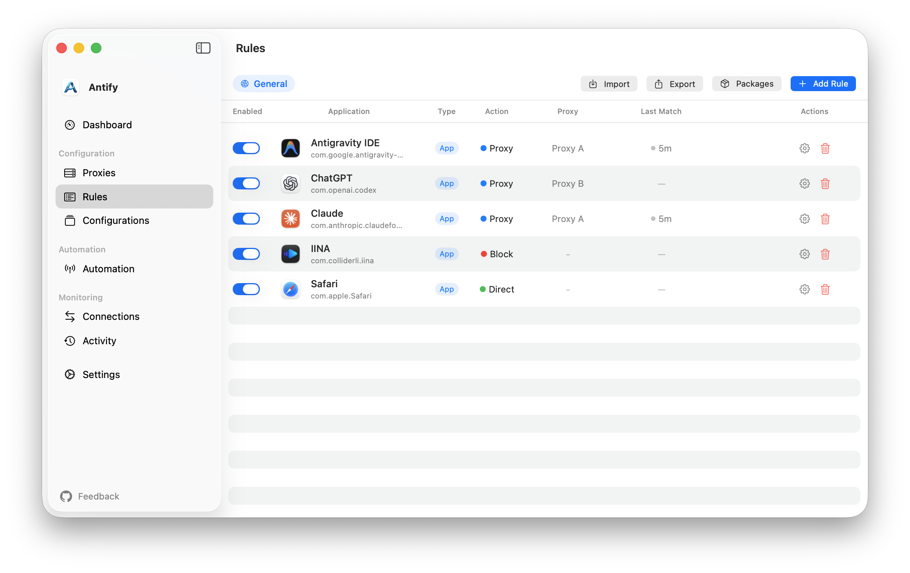

# Antify Feedback

[简体中文](README.md)

[Website](https://antifyapp.com/en) · [Download](https://r2.antifyapp.com/releases/latest/Antify.dmg) · [Guides](https://antifyapp.com/en/guides) · [Changelog](https://antifyapp.com/en/changelog) · [Privacy](https://antifyapp.com/en/privacy)

Antify is a per-app transparent proxy for macOS. It routes connections from selected apps through the proxies you configure, without enabling the macOS system proxy or requiring TUN mode in another proxy client.

This repository is Antify's public tracker for bug reports, feature requests, and product discussions. It does not contain the Antify application source code.



## Features

- Assign `Proxy`, `Direct`, or `Block` actions to individual apps.
- Configure and test SOCKS5, HTTP, and HTTPS proxy servers.
- Keep separate rule sets in `Configurations` and switch them by Wi-Fi network.
- Inspect routing through `Connections`, `Activity`, and `Discovery`.
- Create path-based rules for command-line tools, scripts, and executables.

Antify does not include a proxy service. You need to provide a working proxy server.

## Requirements

- macOS 14.0 or later.
- Approval for the Antify system extension during first-time setup.
- A working SOCKS5, HTTP, or HTTPS proxy server.

## Install

[Download the latest version](https://r2.antifyapp.com/releases/latest/Antify.dmg), or install Antify with Homebrew.

```bash
brew tap cyberlesterr/antify
brew install --cask antify
```

Start with the [system extension installation guide](https://antifyapp.com/en/guides/first-installation), then follow the [complete guide collection](https://antifyapp.com/en/guides) to add a proxy and create app rules.

## Before you open an issue

| If you are stuck on | Guide |
|---|---|
| The extension will not install, or approval is stuck | [Install Antify and its system extension](https://antifyapp.com/en/guides/first-installation) |
| The proxy is configured but will not connect | [Add and test a proxy server](https://antifyapp.com/en/guides/configure-proxy) |
| Sending one app through a proxy, direct, or nowhere | [Set apps to Proxy, Direct, or Block](https://antifyapp.com/en/guides/per-app-routing) |
| Commands launched by your terminal or IDE ignore the proxy | [Route the commands your terminal and IDE launch](https://antifyapp.com/en/guides/dev-tools-proxy) |
| Adding rules for command-line tools and scripts | [Create path rules for CLI tools, scripts, and packages](https://antifyapp.com/en/guides/command-line-rules) |
| Checking whether a rule actually took effect | [Understand Connections, Discovery, and Activity](https://antifyapp.com/en/guides/connections-and-activity) |

## Submit feedback

Search [existing issues](../../issues) before opening a new one.

- [Report a bug](../../issues/new?template=bug_report.md)
- [Request a feature](../../issues/new?template=feature_request.md)

A useful bug report includes the Antify and macOS versions, proxy type, reproduction steps, expected and actual behavior, and relevant screenshots or logs.

For a feature request, describe the problem, the behavior you would like, and any workaround you currently use.

Collect diagnostics from `Settings > General > Diagnostics > Collect Logs…`. GitHub Issues are public, so remove proxy passwords, tokens, and other private information before uploading files.
